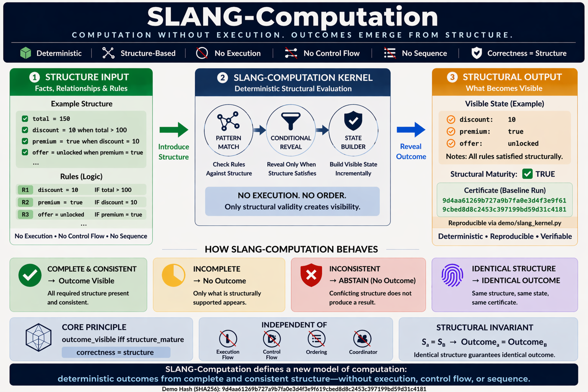

# ⭐ **SLANG-Computation**

**Computation Without Execution — Structural Resolution Kernel**


**Proven in ~459 Bytes.**

Computational outcomes emerge directly from structure — without requiring execution flow, control flow, or prescribed sequencing for correctness.

**Deterministic • Structure-Based • No Execution Flow • No Control Flow • No Prescribed Sequence**

**No Time • No Order • No Coordinator • No Execution Pipeline**

---

## ⚡ **The Claim**

A computational outcome can be determined without execution flow, control flow, or prescribed sequencing — when structure is sufficient.

---

## **The Unifying Principle**

`correctness = structure`

If correctness remains after removing a dependency, that dependency was never fundamental.

---

## **Clarification — Machine-Level Execution**

This reference kernel runs as a minimal Python program and may perform machine-level iteration.

However, this execution is **not** the source of correctness.

Correctness is determined solely by structural sufficiency — not by execution flow, control flow, ordering, or sequencing.

Execution functions only as a **resolution substrate**.

---

## **Practical Interpretation**

Use existing systems to execute.

Use SLANG-Computation to **resolve and validate structural correctness**.

---

## 🌍 **A World Built on Execution**

For decades, computation systems have been built on dependencies:

- execution flow  
- control flow  
- sequence  
- procedural orchestration  
- execution dependency  

Each treated as essential.

But what if they are not?

---

## 🔄 **The Shift**

Across domains, a pattern emerges:

- correctness does not depend on the mechanism we assumed it did  

It can be preserved by something deeper:

- **structure**

---

## 🧱 **Dependency Elimination Framework**

| Domain | Removed Dependency | What Preserves Correctness |
|---|---|---|
| Time | clocks | structure |
| Decision | order | structure |
| Meaning | sequence | structure |
| Money | transactions | structure |
| Truth | agreement | structure |
| Computation | execution | structure |
| AI | inference | structure |
| Cybersecurity | process / pipelines | structure |
| Identity | authority / registry | structure |
| Consensus | voting / quorum | structure |
| Network | connectivity | structure |
| Audit | verification | structure |

Each row removes a dependency — yet correctness remains intact.

Nothing is replaced.  
Nothing is approximated.  
Only the dependency is eliminated.

---

## ⚡ **The One-Line Breakthrough**

A computation can resolve correctly without any prescribed execution process — when the structure is sufficient.

---

## ⚡ **Try it in 30 seconds**

Run the kernel:

```
python demo/slang_kernel.py
```

Run again:

```
python demo/slang_kernel.py
```

Modify structure -> run again.

---

## 🔍 **What You Will Observe**

- deterministic computation resolution  
- no execution flow dependency  
- no control flow dependency  
- no prescribed sequence  
- incomplete structure produces no forced outcome  
- identical structure produces identical result  

---

## 🧭 **Visual Overview**



---

## 🧭 **Framework & References**

### **Docs**
- [Quickstart](docs/Quickstart.md)  
- [FAQ](docs/FAQ.md)  
- [Proof Sketch](docs/Proof-Sketch.md)  
- [Structural Overview](docs/SLANG-Computation-Structural-Resolution.png)  

### **Framework**
- [Dependency Elimination Framework](docs/Dependency-Elimination-Framework.png)

### **Demo**
- [demo/slang_kernel.py](demo/slang_kernel.py)

### **Verification**
- [VERIFY/VERIFY.txt](VERIFY/VERIFY.txt)  
- [VERIFY/FREEZE_DEMO_SHA256.txt](VERIFY/FREEZE_DEMO_SHA256.txt)

### **Repository**
- [demo/](demo/) — kernel  
- [docs/](docs/) — explanation  
- [VERIFY/](VERIFY/) — reproducibility  

---

## ⚡ **The Core Structural Model**

`outcome_visible iff structure_mature`

`structure_mature = complete AND consistent`

Computational correctness is not derived from process.

`correctness = structure`

`computation = resolve(structure) when complete AND consistent`

---

## ⚖️ **What This Is / Is Not**

### **SLANG-Computation IS:**
- a minimal structural computation kernel  
- a deterministic computation resolution engine  
- a proof that execution dependency is not fundamental  
- a structure-first correctness demonstration  

### **SLANG-Computation IS NOT:**
- a full programming language  
- a general-purpose runtime  
- a replacement for all software  
- a denial of machine activity  

---

## ⚠️ **Read This Carefully**

This is not:

- faster execution  
- automated control flow  
- optimized sequencing  

Execution flow is not required for correctness.

Computation does not emerge from process.

It emerges from structure.

---

## 🔥 **What This Proves (Removal of Dependencies)**

This kernel proves that computational correctness does not require:

- execution flow  
- control flow  
- prescribed sequence  
- execution traces  
- authored procedural order  

---

## 🔥 **Structural Resolution Model (Extended)**

`resolve(structure) ->`

- `RESOLVED` if `structure_mature`  
- `INCOMPLETE` if structure incomplete  
- `ABSTAIN` if structure conflicting  

Visibility rule:

`outcome_visible iff structure_mature`

---

## **Implementation Note — ABSTAIN**

ABSTAIN is part of the structural model.

In this reference implementation:

- ABSTAIN is conceptually defined  
- but not implemented in this minimal kernel  

This is intentional.

The kernel isolates the core invariant:

`correctness = structure`

Extended versions may include:

- explicit conflict tracking  
- ABSTAIN propagation  
- structural certificate generation  

---

## 🛡 **Structural Safety Model**

`incomplete -> no forced outcome`  
`conflicting -> no unsafe outcome`  
`complete -> deterministic outcome`

No guessing. No forcing. No artificial execution dependency.

---

## 🔐 **Structural Certificate**

Final structure produces a deterministic certificate:

`same structure -> same certificate`

Certificate is:

- reproducible  
- execution-independent  
- sequence-independent  

`final structure = sufficient proof`

Proof emerges from structure — not from process.

The certificate reflects structural equivalence — not execution history.

---

## 🧠 **Structural Challenge**

Can identical structure produce different computational outcomes?

`S1 = S2`  
`Outcome1 != Outcome2`

If this ever occurs, structural correctness is violated.

A full challenge set is available separately for deeper exploration.

---

## 🔁 **Deterministic Guarantees**

### **Determinism**
`S1 = S2 -> Outcome1 = Outcome2`

### **Order Independence**
Rule order does not matter.

### **Idempotence**
Repeated runs -> identical result.

---

## 🧩 **Reference Demonstration**

### **Scenario 1 — Baseline**
Run:

```
python demo/slang_kernel.py
```

Observe:

- full structure resolves derived outcomes  
- no forced unsupported fields appear  

### **Scenario 2 — Repeatability**
Run again:

- identical result  

### **Scenario 3 — Break Structure**
Modify structure -> run again.

Observe:

- no forced computational outcome  
- system remains structurally silent where support is missing  

### **Scenario 4 — Order Independence**
Reorder rules -> run.

- identical result  

### **Scenario 5 — Direct Injection**
Provide final structure -> run.

- outcome appears immediately  

### **Scenario 6 — Partial Structure**
Provide partial structure -> run.

- no forced outcome  

---

## 🧠 **Critical Insight**

System does not:

- execute correctness through authored flow  
- depend on control flow  
- require prescribed sequencing  
- guess  

Instead:

- it resolves structure  

---

## 🌌 **Why This Is Bigger Than It Looks**

This is a minimal proof that:

- computational visibility does not require prescribed execution flow  
- execution order does not determine correctness  
- computational outcome appears only when structure becomes mature  

If this holds, computation transforms from execution to structure.

This is not the final system — it is the smallest demonstrable proof of a structure-first computation model.

---

## 🧠 **Structural Truth**

A reported value may exist in the system.

But structural computational truth may not.

The system does not reject it.  
The system does not force it.

It simply refuses to grant computational reality to what structure does not support.

---

## 📊 **Comparison**

| Model | Execution Required | Sequence Required | Structure-Based | Deterministic |
|---|---|---|---|---|
| Traditional | Yes | Yes | No | Conditional |
| Rules / Flow Systems | Yes | Often Yes | Partial | Conditional |
| SLANG-Computation | No | No | Yes | Yes |

---

## 🌍 **Implications**

If this scales:

- execution becomes secondary  
- computation becomes structural  
- sequence becomes representational  
- correctness becomes intrinsic  

---

## 🧾 **Structural Lineage**

SLANG-Computation is part of a broader structural pattern emerging across domains:

- SLANG-Computation -> correctness without execution  
- SLANG-Money -> state without transactions  
- SLANG-AI -> decisions without inference pipelines  
- SLANG-Medical -> diagnosis without procedural workflows  
- SLANG-Insurance -> claims without approval chains  
- SLANG-Cybersecurity -> detection without process pipelines  
- SLANG-Audit -> correctness without verification  

Each removes a different dependency.

Yet the outcome remains.

`correctness = structure`

---

## 📜 **License**

See: [LICENSE](LICENSE)

**Reference Implementation (This Repository):**  
This tiny kernel is the official minimal example of the SLANG-Computation model.  
It demonstrates the core principle in its simplest form.

Released as an **Open Standard** — free to use, study, implement, extend, and deploy.

**Architecture and Documentation:**  
CC BY-NC 4.0

---

## 🔭 **Roadmap (Exploratory)**

- structural conflict classification  
- invariant validation  
- multi-structure resolution  
- structural computation certification layers  

---

## 🔗 **Related Structural References**

- [ORL](https://github.com/OMPSHUNYAYA/Orderless-Ledger) — ledger correctness from structure without ordering  
- [STOCRS](https://github.com/OMPSHUNYAYA/STOCRS) — computation from structure without execution  
- [STIME](https://github.com/OMPSHUNYAYA/Structural-Time) — time from valid structural transitions  
- [SSUM-Time](https://github.com/OMPSHUNYAYA/SSUM-Time) — structural clock for time reconstruction and recovery  
- [SLANG-Money](https://github.com/OMPSHUNYAYA/SLANG-Money) — financial state from structure without transactions  
- [SLANG-Audit](https://github.com/OMPSHUNYAYA/SLANG-Audit) — audit correctness from structure without verification, replay, or reconciliation workflows  

---

## 🧭 **Final Statement**

Execution did not create correctness.  
Control flow did not create correctness.  
Sequence did not create correctness.

**Correctness emerged from structure.**
